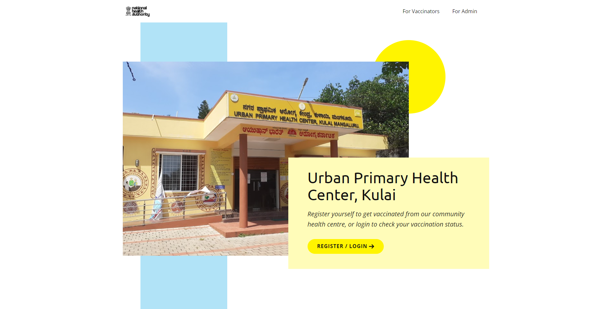

# COVID-19 Vaccination Centre Database Management System 

This Project aims to illustrate the basic concepts of SQL and can be utilized in either
day-to-day or in exigency situations. The following project is a Database
management system to store COVID-19 vaccination status made for a healthcare
centre and mobile pop-up vaccination clinics, which uses SQL concepts to keep a
check on the vaccination status of an individual who had taken a vaccine in either of
the mentioned centres. Based on the user groups, it has an administrator who
maintains the database, a vaccinator who can register and update the vaccination
status of an individual. And there’ll be subjects, who will be able to access and
retrieve their own vaccination status which can act as an assurance as a beneficiary
of the vaccination. It could act as a proof of vaccination which could be used as a
requirement to enter workplace facilities, colleges, public areas or to travel
internationally.
